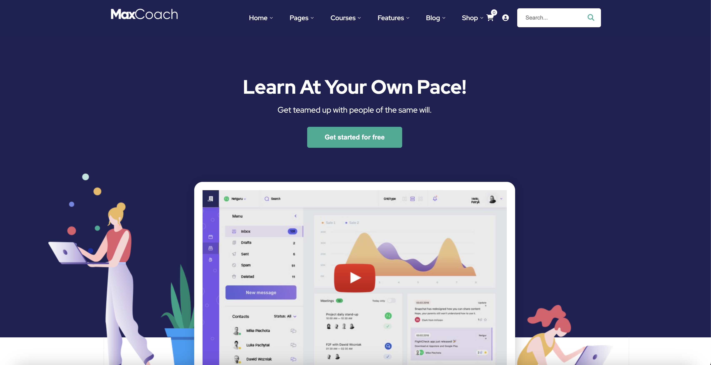
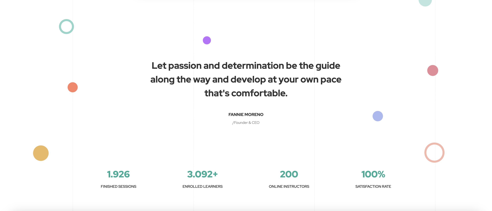
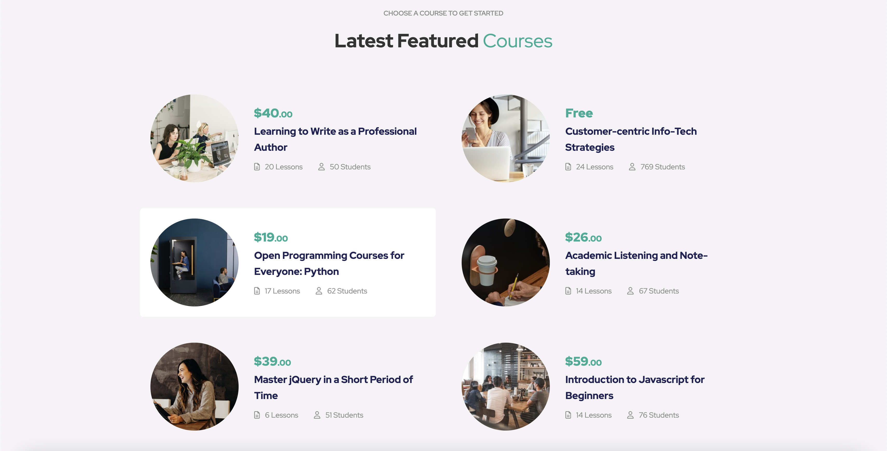
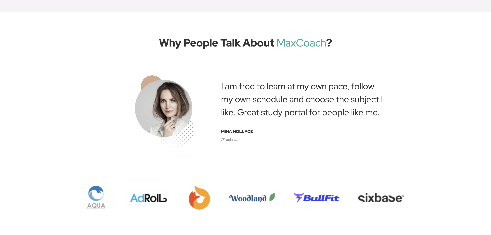
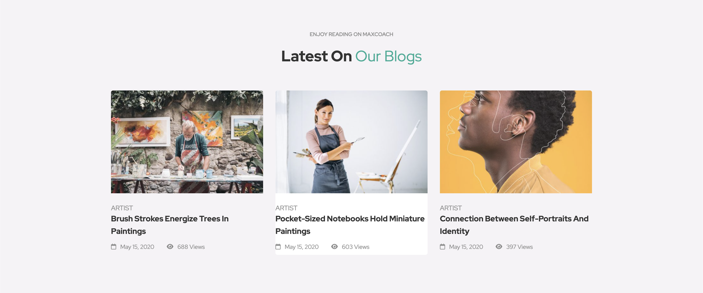
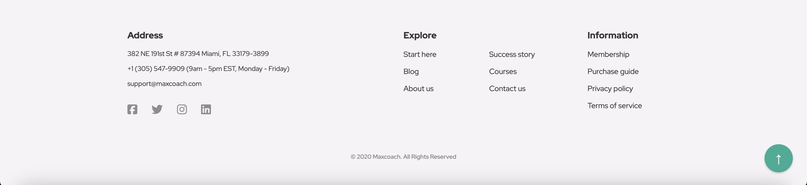

# MaxCoach

This project is a mockup of the website of a generic coaching and tutoring service.

## Features

- The user is greeted by a jumbotron featuring a video frame that can host a video showcasing the business's main services.

- The header features the company logo, a searchbar (functionality to be implemented), and a menu that can be used to access the various sections of the page.

- All buttons on the page change color when hovered.

- Some sections feature decorative circles that expand slightly when hovered.

- A dynamically populated list of courses showcases the business's main offerings.

- The testimonials section functions as a carousel, showcasing a different quote every 6 seconds.

- A dynamically populated blogs section showcases the latest news about the business.

- Finally, the footer contains contact information and important links as well as a button to get back to the top of the page.

